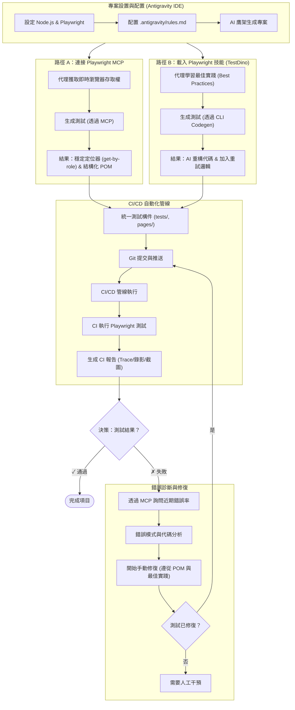
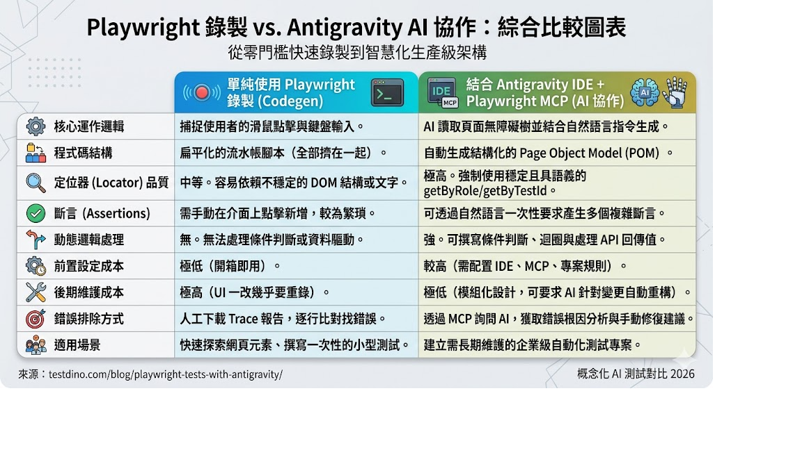

# Playwright MCP Server 整合指南

本專案配置了 Playwright MCP Server，讓您可以透過 Model Context Protocol (MCP) 在 Antigravity 環境中與瀏覽器進行自動化互動。

## 環境資訊

請確保您的系統符合以下環境版本：
- **Node.js**: `v24.14.1` 或以上
- **Playwright**: `v1.59.1`

---

## 什麼是 Playwright MCP？

Model Context Protocol (MCP) 允許像 Antigravity 這樣的 AI 客戶端連接並利用外部工具。透過設定 Playwright MCP Server，AI 代理可以直接操作瀏覽器，執行像是：網頁截圖、抓取資料、以及視覺化驗證等任務。

---

## 在 Antigravity 中配置

要在您的 Antigravity IDE 中啟用此功能，請按以下步驟操作：

1. **開啟反重力設定**：按下快捷鍵 `Ctrl + ,` 開啟設定選單。
2. **搜尋設定**：在設定面板的搜尋框中輸入 `"MCP"`。
3. **新增伺服器**：點擊「新增 MCP 伺服器」(Add new MCP server)。
4. **貼上配置**：建立一個名稱為 `playwright` 的伺服器，並將本專案目錄下 `mcp-config.json` 的內容貼上：

```json
{
  "mcpServers": {
    "playwright": {
      "command": "npx",
      "args": [
        "-y",
        "@playwright/mcp@latest"
      ]
    }
  }
}
```

> **指令說明**：`npx -y @playwright/mcp@latest` 指令會自動同意安裝提示 (`-y`)，並抓取最新版的 Playwright MCP 套件執行，這樣不需要繁瑣的手動全域安裝。

5. **儲存並重新啟動 IDE**：完成配置後，需要重啟 Antigravity 以載入新的 MCP 設定。

完成上述步驟後，您應該能在 MCP 面板中看到 `playwright` 旁邊亮起一個**綠色指示器**，代表運作正常。

## 2026 AI 測試自動化工作流

本專案將 Antigravity IDE、Playwright MCP 以及 Playwright CLI 進行了深度整合。透過以下的視覺化工作流圖表，您可以清楚地了解我們如何從「環境配置」、「代理生成」到「CI 自動化驗證」與「AI 錯誤診斷」，打造一條完整的企業級測試閉環：


*(下方為該工作流程的結構化文字詳情)*

本專案遵循以下由 AI 驅動的自動化測試開發流程：



## Playwright 錄製 vs. Antigravity AI 協作

自動化測試的痛點往往在於後期的維護與腳本穩定度。傳統的 Codegen 提供了一個極低門檻的切入點，但結合 Antigravity IDE 能將產出提升至「生產級架構」。

以下圖表直觀地展示了從「純錄製流水帳」進階到「智慧型 POM 協作」在各個維度上的典範轉移：



*(以下為圖表內容的文字重點整理)*

下表總結了傳統錄製 (Codegen) 與使用 Antigravity AI 協作的主要差異：

| 比較項目 | 單純使用 Playwright 錄製 (Codegen) | 結合 Antigravity IDE + Playwright MCP (AI 協作) |
| :--- | :--- | :--- |
| **核心運作邏輯** | 捕捉使用者的滑鼠點擊與鍵盤輸入 | AI 讀取頁面無障礙樹結合自然語言指令生成 |
| **程式碼結構** | 扁平化的流水帳腳本（全部擠在一起） | 自動生成結構化的 **Page Object Model (POM)** |
| **定位器 (Locator)** | 中等。容易依賴不穩定的 DOM 結構或文字 | **極高**。優先使用具語義的 `getByRole` / `getByTestId` |
| **斷言 (Assertions)** | 需手動在介面上點擊新增，較為繁瑣 | 可透過自然語言一次性要求產生多個複雜斷言 |
| **動態邏輯處理** | 無。無法處理條件判斷或資料驅動 | **強**。可撰寫條件判斷、迴圈與處理 API 回傳值 |
| **前置設定成本** | 極低（開箱即用） | 較高（需配置 IDE、MCP、專案規則） |
| **後期維護成本** | 極高（UI 一改幾乎要重錄） | **極低**（模組化設計，可要求 AI 自動重構） |
| **錯誤排除方式** | 人工下載 Trace 報告，逐行比對找錯誤 | 透過 MCP 詢問 AI，獲取錯誤根因分析與修復建議 |
| **適用場景** | 快速探索網頁元素、撰寫一次性小型測試 | 建立需長期維護的**企業級自動化測試專案** |

---

## 專案開發進度與架構

本專案採用 Page Object Model (POM) 設計模式進行自動化測試開發。

### 📂 目錄結構

-   `tests/`: 存放所有 Playwright 測試腳本 (`.spec.ts`)。
-   `pages/`: 存放所有頁面物件 (Page Objects)，封裝 UI 互動邏輯。
-   `constants.ts`: 存放全域常數，如 URL 與測試資料。
-   `.env.template`: 環境變數範本。

### ✅ 已實現測試流程

1.  **登入流程 (`tests/login-page.spec.ts`)**
    -   驗證 `https://storedemo.testdino.com/login` 的登入功能。
    -   支援環境變數導入憑證。
    -   使用 Soft Assertions 驗證登入後狀態。
2.  **購物車流程 (`tests/cart-flow.spec.ts`)**
    -   驗證「加入產品 -> 開啟購物車 -> 進入結帳頁面」的完整流程。
    -   採用強健的定位器 (Locators) 以應對動態 UI。

### ⚙️ 環境變數設定

請建立 `.env` 檔案（參考 `.env.template`）並填入以下資訊：
```env
STOREDEMO_EMAIL=your-email
STOREDEMO_PASSWORD=your-password
```

### 🏃 執行測試指令

```powershell
# 執行所有測試
npx playwright test

# 執行特定測試並開啟追蹤 (Trace)
npx playwright test tests/cart-flow.spec.ts --trace on

# 以有頭模式執行
npx playwright test --headed
```

---

## TestDino 整合與 MCP 配置

為了解決自動化測試中最令人頭痛的 Flaky Tests（不穩定測試）問題，本專案也整合了 TestDino，讓 AI 能夠根據歷史大數據分析錯誤並自動修復。

### 1. 安裝 TestDino 測試套件
首先，將 TestDino 的官方套件安裝為開發依賴：
```powershell
npm install tdpw --save-dev
```

### 2. 配置 TestDino MCP
透過新增 TestDino MCP 伺服器，Antigravity 代理將能直接讀取專案過去的錯誤模式。
請打開 Antigravity 的 MCP 設定 (`Ctrl + ,` 搜尋 "MCP")，在原本的配置中加入以下內容：
```json
{
  "mcpServers": {
    "testdino": {
      "command": "npx",
      "args": ["-y", "testdino-mcp"],
      "env": {
        "TESTDINO_PAT": "your-pat-here"
      }
    }
  }
}
```
*(請將 `your-pat-here` 替換為從 TestDino 後台取得的 Personal Access Token)*

### 3. TestDino 常用操作指令
配置完成後，您可以使用以下指令來上傳或即時串流測試結果至測試儀表板：
```powershell
# 執行 Playwright 測試，並將結果即時串流 (Streaming) 至 TestDino
npx tdpw test

# 執行傳統測試後，手動上傳產生的 HTML 測試報告
npx playwright test
npx tdpw upload ./playwright-report --upload-html
```

---

## 驗證連線 (Original MCP Section Content)

設定並重啟完成後，您可以透過與 AI 代理對話來測試是否連線成功。

💡 **提示**：您可以透過詢問客服人員（或 AI 助理）以下指令來驗證：
> 「開啟瀏覽器並造訪 https://example.com」

如果 AI 順利啟動瀏覽器並返還了螢幕截圖或網頁資訊，就表示您的 Playwright MCP 已經完美運作了！
